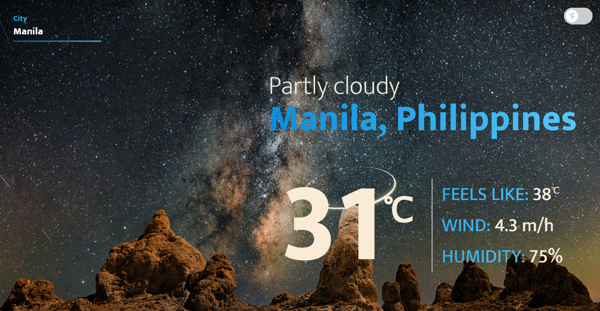

# Weather App

The Weather App is a simple web application that allows users to check the weather conditions of a specific city. It utilizes the Fetch API and demonstrates the use of promises and asynchronous programming in JavaScript.

## Preview

Check out the live demo [here!](https://innopaolo.github.io/weather-app/)

## Features

- User-friendly interface with city input.
- Real-time weather data fetched from an API.
- Option to toggle between Celsius and Fahrenheit.
- Display of key weather information including temperature, feels-like temperature, wind speed, and humidity.
- Responsive web design and animated fade in for info box.
- Error handling when no match is found.

## What I Learned

1. **Asynchronous Programming**: I gained a deeper understanding of asynchronous programming by working with the Fetch API to make asynchronous requests to an external API. This allowed me to fetch real-time weather data without blocking the main thread.

2. **Promises**: I learned how to use promises to handle asynchronous operations more effectively. Promises provided a structured way to manage the flow of data and handle errors when fetching data from the API.

3. **Dynamic UI Updates**: I implemented dynamic updates to the user interface based on the retrieved weather data. This involved fading in an info box and displaying weather information in a user-friendly format.

4. **API Integration**: I practiced integrating external APIs into web applications. I used the WeatherAPI to fetch weather data and display it to the user, and also used a geolocation API to extract the user's location. This ensures that the local weather will show on initial webpage load.

6. **Webpack Integration**: I explored various aspects of integration, such as module bundling, asset management, and code splitting, to streamline the development workflow. I was able to resolve a previous issue encountered in my Todo App project, where bundling assets together with the script proved challenging. Additionally, I experimented with VSCode extensions that required module dependencies, such as Prettier for code formatting, Babel for JavaScript transpilation, and ESLint for code linting.

## Technologies Used

- 
-    
- 
- 

## Acknowledgments

- Background image: [Unsplash](https://unsplash.com/)
- Weather data: [WeatherAPI](https://www.weatherapi.com/)
- Fonts: [Google Fonts](https://fonts.google.com/)

I hope the weather is great wherever you are 🤝.
